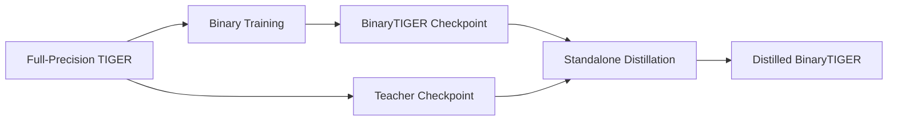

# TIGER 二值化与知识蒸馏技术方案

本文档描述 TIGER 的二值化与知识蒸馏改造方案，目标是为后续代码实现提供统一设计基线。本文档强调的是“目标方案”，不是对当前仓库实现状态的逐项复述。

核心原则如下：

- 二值化训练与蒸馏训练保持分离，避免把两类优化目标耦合到同一训练阶段
- 优先围绕 `nn.Conv1d` 做统一改造，尽量减少对原始 TIGER 主体结构的侵入
- 对敏感层采用保护策略，保证训练稳定性与语音分离质量
- 蒸馏阶段只在教师模型明显优于学生模型的时频区域传递知识

## 1. 模型结构分析

TIGER 的主干可以概括为：

```text
输入波形 -> STFT -> 编码器 -> 分离器 -> 解码器 -> iSTFT -> 输出波形
```

从实现与论文结构映射来看，TIGER 的核心组成包括：

- 编码器与解码器：负责时频表示与隐空间特征之间的映射
- `BandSplit`：将频域切分为多个非均匀子带，并做子带投影
- `FFI`：交替进行频域建模与时间帧建模
- `MSA`：在不同卷积感受野之间进行多尺度特征融合
- `F³A`：在频率轴和时间轴上施加全局注意力
- 频带恢复模块：将各子带结果恢复回完整频域表示

本方案的关键判断是：TIGER 内部绝大多数可压缩计算都集中在 `nn.Conv1d`。因此，二值化改造以卷积层为统一替换目标，而不是分别为每个子模块单独设计二值版本。

## 2. 二值化设计

### 2.1 目标替换范围

默认改造对象为 TIGER 中满足条件的 `nn.Conv1d`，重点覆盖：

- `BandSplit` 之后的普通卷积
- FFI 中的局部卷积与多尺度卷积
- MSA 中的多尺度卷积分支
- 频带恢复前的常规卷积
- 编码器 / 解码器中非敏感卷积层

默认不直接二值化以下敏感部分：

- `BandSplit` 首层投影
- `F³A` 的 `q_proj` / `k_proj` / `v_proj`
- 输出 `mask` 生成层
- 靠近 `iSTFT` 恢复路径的关键层

### 2.2 核心模块

方案采用三个二值化基础组件：

1. `RSign`
   作用：提供带可学习阈值的二值激活，将输入离散到 `{-1, +1}`

2. `RPReLU`
   作用：在激活二值化前后对特征分布进行重塑，缓解信息损失

3. `BinaryConv1d`
   作用：对卷积权重进行二值化，前向使用二值权重，反向通过 STE 保留梯度传播

设计要求：

- 对外接口保持与 `nn.Conv1d` 一致
- 支持从现有 `Conv1d` 权重直接初始化
- 支持训练期权重 clamp 与二值前向切换

### 2.3 动态替换机制

通过递归遍历模型子树，将符合条件的 `nn.Conv1d` 替换为 `BinaryConv1d`。保护策略通过名称模式和模块位置共同控制，避免把敏感层误替换为二值层。

推荐保护模式：

```yaml
protect_patterns:
  - bandsplit.proj
  - q_proj
  - k_proj
  - v_proj
  - mask_gen
  - istft
```

在工程实现上，保护条件需要同时支持：

- 按模块名匹配
- 按模块类型匹配
- 注意力模块判定需“严格匹配”，不要仅凭子串（例如 `att`）泛匹配；否则会把 `globalatt` 等非注意力分支误保护，显著降低二值化覆盖率
- 按卷积属性匹配，例如 `kernel_size=1`

## 3. 训练策略

### 3.1 训练总原则

训练仍然保持“二值化训练”和“蒸馏训练”两条独立链路：

1. 先训练全精度 TIGER 作为 teacher
2. 再训练 BinaryTIGER，只做二值化优化
3. 最后加载 teacher 与二值 student，单独执行蒸馏训练

这样做的原因是：

- 二值化阶段的主要目标是让 student 在低比特约束下稳定收敛
- 蒸馏阶段的主要目标是做性能恢复，而不是继续探索二值切换过程
- 把二值化和蒸馏拆开后，实验更容易复现，也更便于比较不同保护策略的影响

### 3.2 二值化训练阶段

二值化训练采用三阶段渐进式思路，但只在“二值化训练链路”内部生效：

1. 激活预热阶段
   目标：先让网络适应二值激活或二值前向带来的分布变化

2. 权重二值化主训练阶段
   目标：启用主要二值卷积训练，让模型适应真实二值权重约束

3. 二值模型精调阶段
   目标：在不引入蒸馏损失的前提下，对二值 student 做最后稳定化

说明：

- 这里的第三阶段仍属于“二值化训练”内部，而不是知识蒸馏训练
- 如果工程实现上暂时只落地两阶段，也应在文档与配置中明确保留向三阶段扩展的接口

### 3.3 蒸馏训练阶段

蒸馏训练单独进行，不复用二值化训练中的阶段切换逻辑。

蒸馏阶段固定如下关系：

- teacher：已训练完成的全精度 `TIGER`
- student：已完成二值化训练的 `BinaryTIGER`

蒸馏总损失为：

```text
L_total = L_task + lambda_kd * L_dispatch
```

其中：

- `L_task` 是原始语音分离任务损失
- `L_dispatch` 是选择性知识蒸馏损失

## 4. DISPATCH 选择性蒸馏

蒸馏阶段不直接对所有时频位置一视同仁，而是只在教师模型显著优于学生模型的区域传递知识。

流程如下：

1. 将 teacher / student / target 波形转换到时频域
2. 对幅度谱切分为固定大小 patches
3. 计算每个 patch 的 Knowledge Gap Score
4. 选择 top-k% 的关键 patch
5. 仅对这些 patch 计算 student 与 teacher 的蒸馏损失

Knowledge Gap Score 的核心思想是：

- 若某个 patch 上 teacher 比 student 更接近目标，则该 patch 更值得蒸馏
- 若 teacher 并未显著优于 student，则没有必要强行蒸馏，以免引入无效甚至有害的约束

推荐实现参数：

- `patch_size = 16`
- `top_k_percent = 0.3`
- `n_fft` 与 `hop_length` 与训练数据采样率和当前 STFT 设置保持一致

## 5. 参数与计算量分析

按照方案分析，TIGER-Small 中可被 `Conv1d` 二值化覆盖的参数占比很高，二值化的收益主要来自这部分卷积权重。

参考估算：

- 原始模型参数量约 `0.55M` 到 `0.95M`
- `Conv1d` 参数占主体
- 在保护敏感层后，仍有大约 `70%` 的总参数具备二值化潜力

等效计算量评估采用：

```text
等效 FLOPs = FP32_FLOPs(保护层) + BOPs(二值化层) / 64
```

对应的工程判断是：

- 参数存储可显著压缩
- 等效计算量可进一步下降
- 实际推理加速取决于目标硬件是否对 bitwise 运算友好

因此，本方案更适合用于：

- 手机端语音分离
- IoT 语音处理器
- 对内存与功耗敏感的边缘设备

## 6. 模块级策略

各模块建议策略如下：

| 模块 | 建议策略 | 原因 |
| --- | --- | --- |
| `BandSplit` 首层投影 | 保持 FP32 | 子带切分信息过早丢失会影响全局分离质量 |
| FFI 中普通卷积 | 二值化 | 参数量大，且对二值化更友好 |
| MSA 多尺度卷积 | 二值化 | 是主要压缩收益来源之一 |
| `F³A` 的 Q/K/V 投影 | 保持 FP32 | 注意力分数对量化误差极其敏感 |
| 频带恢复关键 `1x1` | 默认保护 | 位于信息瓶颈处，建议作为可配置保守项 |
| 输出 `mask` 生成层 | 保持 FP32 | 直接影响最终掩码质量 |

配套缓解手段如下：

- 使用 `RPReLU` 缓解特征分布畸变
- 使用 STE 保持二值层可训练
- 通过渐进式阶段训练降低收敛震荡
- 通过 DISPATCH 蒸馏恢复困难区域性能

## 7. 工程落地要求

后续代码实现需要满足以下要求：

- 新增 `BinaryConv1d`、`RSign`、`RPReLU` 等基础层
- 提供递归替换 `Conv1d` 的转换器
- 保护策略可通过 YAML 配置控制
- 二值化训练系统与蒸馏训练系统分离
- 蒸馏训练支持加载 `teacher_ckpt` 与 `student_init_ckpt`
- 训练日志中输出二值化覆盖比例、保护层列表和关键蒸馏超参数

建议配置拆分为两类：

1. 二值化训练配置
   用于从全精度初始化得到二值 student

2. 蒸馏训练配置
   用于加载固定 teacher 与已训练好的二值 student，做独立蒸馏精调

## 8. 推荐实验顺序

本项目后续推荐统一采用以下实验顺序：

1. 训练或准备全精度 `TIGER` teacher
2. 运行二值化训练配置，得到 `BinaryTIGER`
3. 以二值模型最优权重为 student 初始化，运行独立蒸馏配置
4. 分别评估全精度、二值化、蒸馏后三个模型

对应关系如下：



该顺序是本文档的硬性约束之一：蒸馏训练不与二值化主训练混跑。

## 9. 文档结论

本方案的核心价值在于：

- 以 `Conv1d` 为统一改造目标，最大化复用 TIGER 现有结构
- 通过敏感层保护减少语音分离质量崩塌风险
- 通过独立蒸馏训练恢复二值 student 在关键时频区域的表现
- 在保持工程可控性的同时，追求更高的压缩率与更低的等效计算量

后续代码改造、配置调整与实验记录均应以本文档为准。
